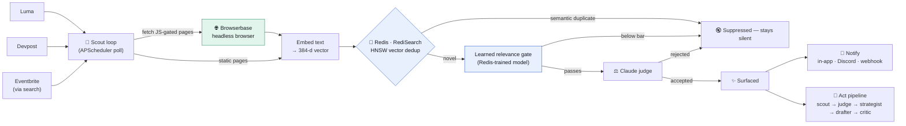
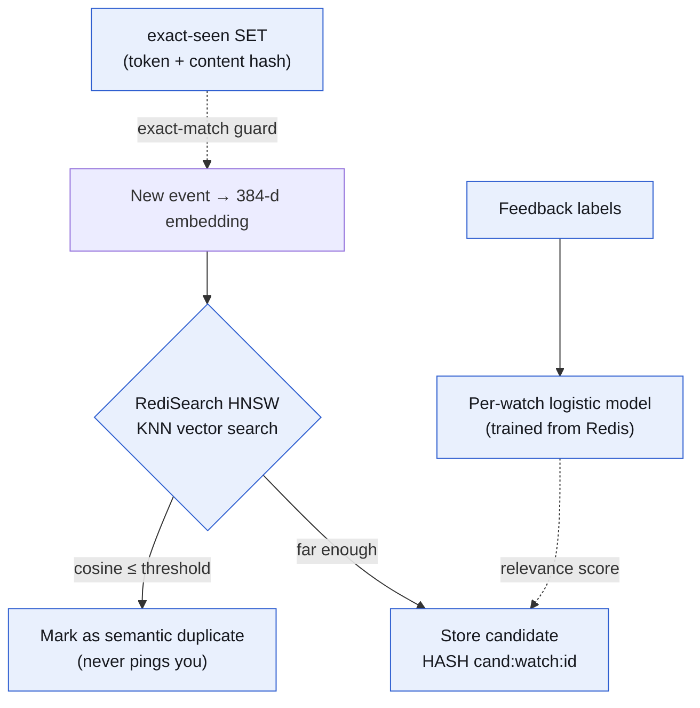
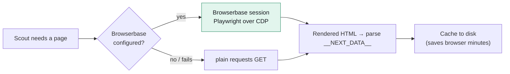
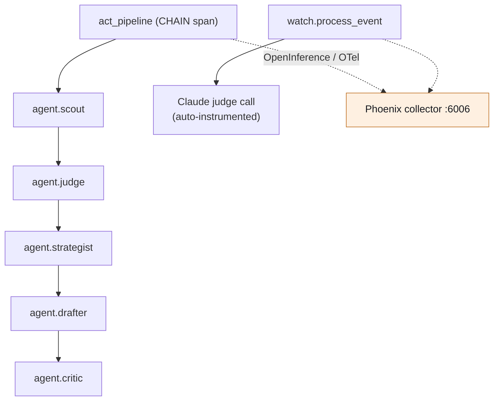
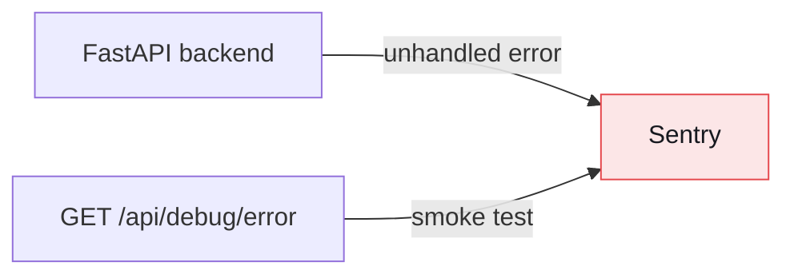

<p align="center">
  
</p>

<h1 align="center">Lookout</h1>

<p align="center"><strong>The silence is the point.</strong><br/>A watcher that only interrupts you when something actually matters.</p>

<p align="center"><em>FOMO is NOMO — No More.</em></p>

---

## What is Lookout?

The internet never stops posting events, hackathons, and opportunities — and almost none of it is worth a notification. Lookout is a **suppression engine**: you describe what you care about in plain English, and it quietly watches the web, throwing away the noise (duplicates, off-topic, things it already showed you) and pinging you **only** for the few things that survive.

It's the opposite of a feed. Lookout's job is to stay quiet — and to be *right* the rare time it speaks.

### Example

> **You ask:** "AI/ML hackathons and events in San Francisco."

Lookout watches Luma, Devpost, and (via search) Eventbrite. Over a session it might see **40 updates**:

- **31 suppressed** — semantic duplicates of things you already saw + off-topic listings.
- **7 silenced** — below your learned relevance bar.
- **2 surfaced** — *"NEW: In-person LLM Agents Hackathon in SF — registration just opened."*

The moment that 2nd one lands, you get a **Discord ping** (and an in-app toast). Everything else stayed silent. That's the product.

---

## How it works



Two observability layers wrap this pipeline (shown per-tool below): **Arize Phoenix** traces every Claude call and agent stage, and **Sentry** captures backend errors.

---

## The stack, tool by tool

Each sponsor tool does one clear job. Here's exactly where each one plugs in.

### 🧠 Redis — the suppression memory

Redis (Redis Stack / **RediSearch**) is the brain of the suppression engine. It is used in **five distinct ways**:



| Use | Where | What it does |
|---|---|---|
| **Semantic dedup** | `FT.CREATE idx:cand` HNSW (384-d, cosine) in `redis_store.py`; KNN in `engine.semantic_duplicate` | Links each new event to already-seen ones; near-duplicates are suppressed, never surfaced. |
| **Exact-seen guard** | `seen:<watch>` sets (`engine.process_event`) | Event token + content hash so the same listing is never reprocessed. |
| **Candidate store** | `cand:<watch>:<cid>` hashes | Source of truth for every surfaced/suppressed candidate + its judgment. |
| **Learned relevance** | `learning.py` logistic model | Trains on 👍/👎 feedback stored in Redis to filter *before* spending a Claude call. |
| **App state** | Notifier + profile + precision curve | Delivery config, applicant profile, and the falling false-alarm curve. |

### 🌐 Browserbase — the resilient fetch

Many event listings are JavaScript-gated. Browserbase gives Lookout a **real headless browser** to render them, with a graceful fallback so a demo never breaks.



- **Where:** `scrape_source.py` → `_fetch_with_browserbase()` (`Browserbase` session + Playwright `connect_over_cdp`).
- **Why it matters:** real-browser rendering for hard pages, automatic fallback to `requests`, and a disk cache so repeated polls don't re-hit the network.

### 📈 Arize Phoenix — agent observability

Every LLM call and every agent stage is a **span** in Phoenix, so you can watch the suppression engine and the 5-agent act pipeline reason in real time.



- **Where:** `tracing.py` → `setup_tracing()` registers `phoenix.otel` + Anthropic instrumentation; `agent_span()` / `set_span_output()` wrap `watch.process_event`, `act_pipeline`, and each `agent.<stage>`.
- **Why it matters:** judges can see *why* something was surfaced or suppressed — the full trace tree, every Claude call, every stage output.

### 🛡️ Sentry — backend error monitoring

Sentry watches the backend so failures surface immediately during the demo — kept **error-only** so it never overlaps Phoenix's tracing.



- **Where:** `tracing.py` → `setup_sentry()` (called before app startup in `app.py`); `GET /api/debug/error` is a deliberate smoke test.
- **Why it matters:** zero-config backend error capture, isolated from the agent runtime.

---

## Notifications

| Channel | Status | Notes |
|---|---|---|
| **In-app ping** | ✅ live | Toast + chime + native notification on every surfaced match. |
| **Discord** | ✅ live | Real webhook POST the moment a match is surfaced (`notify.py`). |
| **Webhook** | ✅ live | POST surviving alerts to your own endpoint. |
| **Email** | ⚠️ stub | Address is stored; SMTP sender not yet wired. |

Notifications fire **only** on live, accepted matches — never on historical backfill.

---

## Quickstart

**Prerequisites:** Redis Stack (RediSearch), Python 3.11+, Node 18+.

```bash
# 1. Redis Stack (vector search)
docker run -d --name lookout-redis -p 6379:6379 redis/redis-stack:latest

# 2. Backend (FastAPI)
python -m venv venv-backend && source venv-backend/bin/activate
pip install -r requirements.txt
export REDIS_URL=redis://localhost:6379
export ANTHROPIC_API_KEY=sk-ant-...          # Claude judge (falls back to a stub if unset)
uvicorn lookout.app:app --reload --port 8000

# 3. Frontend (Vite)
npm install
npm run dev                                   # http://localhost:5173
```

### Key environment variables

| Variable | Purpose |
|---|---|
| `REDIS_URL` | Redis Stack connection. |
| `ANTHROPIC_API_KEY` | Claude judge + spec compile. |
| `LOOKOUT_SITE_SOURCES` | `luma,devpost` (add `search` for Eventbrite via Tavily). |
| `LOOKOUT_DISCORD_WEBHOOK` | Discord channel for live pings. |
| `BROWSERBASE_API_KEY` / `BROWSERBASE_PROJECT_ID` + `LOOKOUT_USE_BROWSERBASE=1` | Headless-browser fetch. |
| `TAVILY_API_KEY` | Search-based sources (Eventbrite, etc.). |
| `PHOENIX_COLLECTOR_ENDPOINT` | Arize Phoenix tracing (default `http://localhost:6006`). |
| `SENTRY_DSN` | Backend error monitoring. |

### Demo hook

In the browser console: `lookout.fire()` re-scans the sources and pings you (dashboard + Discord) the instant a fresh match surfaces.

---

<p align="center"><strong>FOMO is NOMO.</strong></p>
