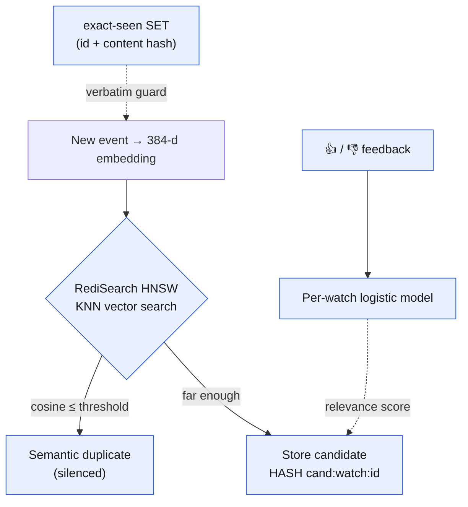
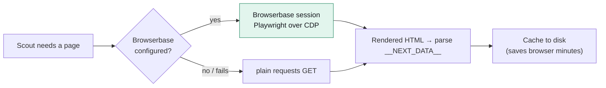
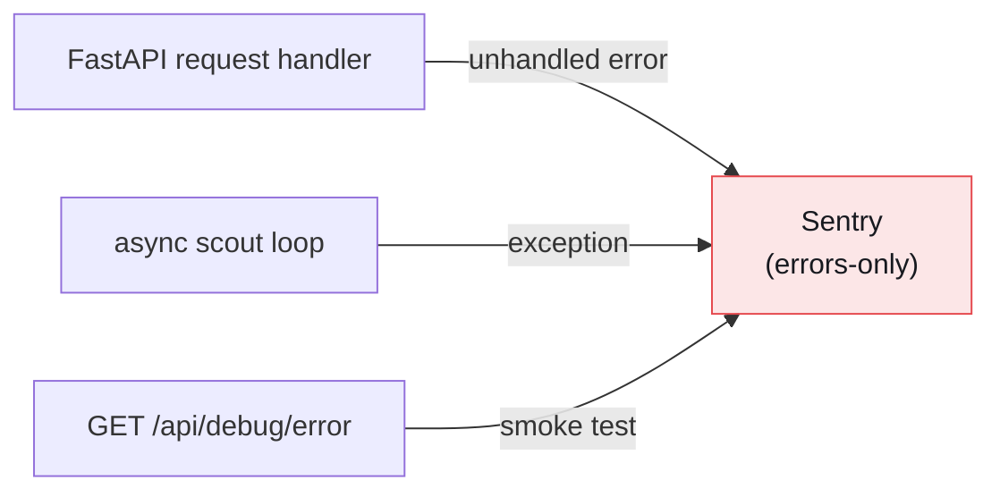
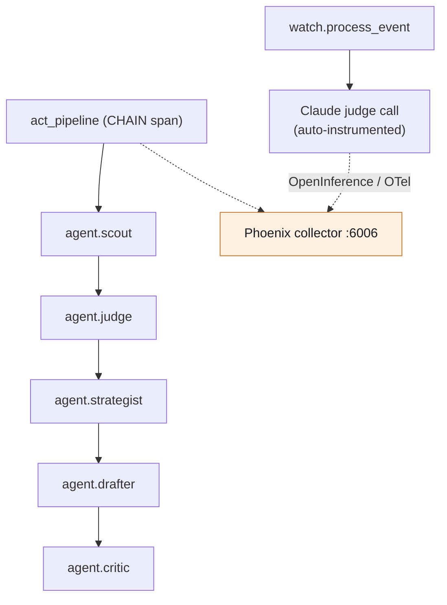
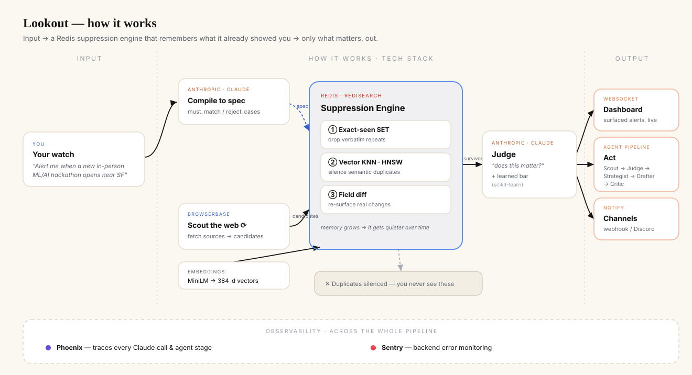

<div align="center">
  

  <h3>The first alert tool built to notify you <em>less</em>.</h3>
  <p><em>A watch → judge → act agent that remembers what it already told you, and stays quiet about everything else.</em></p>

  <p>
    
    
    
    
    
  </p>
</div>

---

---

## 📚 Contents

- [🎯 What it actually does](#-what-it-actually-does)
- [🆚 Why this is not a normal event finder](#-why-this-is-not-a-normal-event-finder)
- [🔄 How it works, end to end](#-how-it-works-end-to-end)
- [🧱 Tech stack](#-tech-stack)
- [🔍 Inside the stack](#-inside-the-stack) — [Redis](#-redis--the-suppression-engine-itself-not-a-cache) · [Browserbase](#-browserbase--the-web-watching-layer) · [Sentry](#-sentry--error-monitoring-on-the-live-pipeline) · [Phoenix](#-arize-phoenix--agent-observability)
- [🚀 Running it yourself](#-running-it-yourself)
- [🔌 API surface](#-api-surface)
- [🧭 Architecture at a glance](#-architecture-at-a-glance)
- [📁 Repo layout](#-repo-layout)
- [👥 Team](#-team)

## 🎯 What it actually does

Every alert tool — Google Alerts, RSS, "track this search" — is built to notify you **more**. They re-fire on every match, every duplicate, every reword. You end up muting them.

**Lookout is a suppression engine.** For every change it detects on the web, it asks two questions before it ever pings you:

1. **Have I effectively shown you this already?** (semantic duplicate — checked against alert history in Redis vector search)
2. **Does it actually matter to you?** (relevance — judged by an LLM against a spec compiled from your plain-English ask; runs on a local **Ollama** model by default, or Claude if you'd rather pay for one)

It only surfaces an alert when **both** clear the bar. The longer it runs, the quieter and sharper it gets, because its memory of "what you've already seen" keeps growing. The single watchful eye in our logo is the point: **one alert that matters**, out of all the noise it silenced.

> The demo watches **events and hackathons**, but that noun is swappable. The same engine works on status pages, filings, restocks, job boards, or any source that changes over time.

---

## 🆚 Why this is not a normal event finder

| | Normal event finder / Google Alerts | **Lookout** |
|---|---|---|
| **Goal** | Surface *more* matches | Surface *fewer* — only what's new **and** relevant |
| **Repeats** | Re-alerts on the same item reworded | **Suppresses semantic duplicates** via Redis vector KNN |
| **Relevance** | Keyword match | **LLM-judged** (local Ollama by default) against a compiled spec + a per-watch learned threshold |
| **Memory** | Stateless per query | **Stateful** — remembers every alert it ever surfaced (vectors in Redis) |
| **Changes** | Either silent or re-alerts wholesale | Detects **meaningful field changes** (closed→open, time/venue) and re-surfaces *only those* |
| **Over time** | Same noise forever | **Gets quieter** as its memory grows |
| **Output** | A list | A **watch → judge → act** pipeline that drafts a response for your approval |

An event finder answers *"what exists?"*. Lookout answers *"what changed that I haven't already seen and that I actually care about?"* — which is a fundamentally different (and harder) problem.

---

## 🔄 How it works, end to end

**Lookout** is a tireless watcher for live opportunities. You describe what you care about in plain English ("Alert me when a new in-person ML/AI hackathon opens registration within 100 mi of SF"). Lookout:

1. **Compiles** that into a structured matching spec (`must_match` / `reject_cases`) using Claude.
2. **Watches** the web continuously, pulling candidate items from real sources.
3. **Suppresses** noise — exact repeats, semantic duplicates, and irrelevant items.
4. **Surfaces** only the survivors in real time over a WebSocket to a calm dashboard.
5. **Acts** — on demand, runs a 5-stage agent pipeline (Scout → Judge → Strategist → Drafter → Critic) to draft a response for your approval.
6. **Learns** — your thumbs up/down trains a per-watch relevance threshold, so the false-alarm rate visibly falls over the session.

---

## 🧱 Tech stack

| Layer | Technology | Role |
|---|---|---|
| **Frontend** | Vanilla JS + Vite, hand-rolled SVG charts | Calm "Watercolor" dashboard; Search → Stay → Notify flow |
| **Backend** | FastAPI + Uvicorn (Python 3.11) | REST + WebSocket API, async scout loop |
| **Suppression / memory** | **Redis Stack (RediSearch, HNSW vectors)** | The product core — dedup, "seen" memory, metrics |
| **Embeddings** | `sentence-transformers/all-MiniLM-L6-v2` (384-d) | Turns each candidate into a vector for KNN |
| **Reasoning** | Pluggable judge: **Ollama** (local, free, default) / Anthropic Claude / deterministic stub | Spec compile + "does this matter?" judging — set via `LOOKOUT_JUDGE_PROVIDER` |
| **Learning** | scikit-learn (per-watch logistic model) | Tunes the relevance threshold from feedback |
| **Web watching** | `requests` (default) + optional **Browserbase** (Playwright over CDP) | Fetch layer for real source pages (Luma, etc.) |
| **Tracing** | **Arize Phoenix** + OpenInference (OpenTelemetry) | Every Claude call + agent stage as a span |
| **Error monitoring** | **Sentry** | Backend error capture across the live pipeline |
| **Scheduling** | APScheduler | Drives the periodic poll |

---

## 🔍 Inside the stack

> Four pieces do the heavy lifting. Here is exactly where each one plugs into the pipeline, with a diagram apiece.

### 🧠 Redis — the suppression engine itself, not a cache

Redis is the heart of the product. We use **Redis Stack with the RediSearch module** to run a **vector index** over every alert Lookout has ever surfaced. This is what lets Lookout *remember* and *stay quiet*.

**What we store.** Each candidate is a Redis HASH `cand:{watch_id}:{id}` holding its fields plus a 384-dimensional `FLOAT32` embedding (`vec`). On startup we create an HNSW vector index:

```text
FT.CREATE idx:cand ON HASH PREFIX 1 cand:
  SCHEMA watch_id TAG  source TAG  state TAG  title TEXT  url TEXT
         vec VECTOR HNSW 6 TYPE FLOAT32 DIM 384 DISTANCE_METRIC COSINE
```
> Source: `lookout/redis_store.py` → `RedisStore.ensure_index()`

**Three suppression layers, all in Redis** (see `lookout/engine.py` → `process_event`):

1. **Exact-dup memory.** A Redis SET per watch (`watch:{id}:seen`) holds event ids + content hashes. If we've seen it verbatim, we drop it instantly — no embedding, no Claude call.
2. **Semantic-dup KNN.** For a new candidate we run a hybrid vector query, scoped to the watch's namespace, and compare cosine distance against a tunable threshold:
   ```text
   (@watch_id:{w_ml_hack})=>[KNN 3 @vec $bvec AS score]
   ```
   > Source: `lookout/engine.py` → `semantic_duplicate()`. If the nearest neighbor is within `LOOKOUT_DUP_DISTANCE` (default `0.08`), the item is marked `state="duplicate"`, linked to the original, and **silenced** — counted under "duplicates silenced" instead of alerting you.
3. **Change detection.** If an item we've seen comes back with a *watched field* changed (`status`, `starts_at`, `location`), we re-surface it as `state="changed"` — the one case where re-alerting is the right call.

**Why this threshold is the product.** Too loose and Lookout becomes Google Alerts (re-fires on rewordings); too tight and it misses real updates. The tunable semantic-similarity dial *is* the moat. Redis also stores the **false-alarm curve** (a sorted set per watch, `watch:{id}:metrics`) so the dashboard can show precision improving live.

> **Operational note:** the index requires the RediSearch module, so we run **Redis Stack** (e.g. `redis/redis-stack`), not vanilla Redis.



### 🌐 Browserbase — the web-watching layer

Browserbase is how Lookout actually *looks at the web* in a real, cloud-hosted browser. The scrape source (`lookout/scrape_source.py`) has a pluggable fetch transport:

- When `LOOKOUT_USE_BROWSERBASE=1` and credentials are present, it **creates a Browserbase session and drives a real Chromium over CDP with Playwright** (`_fetch_with_browserbase`): connect → `page.goto(url)` → return rendered HTML. This handles JS-heavy / bot-protected pages without us running browser infra.
- Otherwise it falls back to a plain `requests` GET (Luma server-renders, so both paths yield the same structured data — this keeps Browserbase minutes cheap).

Fetched HTML is parsed (Luma's `__NEXT_DATA__` JSON) into the Lookout event schema and **cached to disk**, so repeated polls don't re-hit the network or burn quota. The fetch is wrapped in fail-soft error handling so a flaky page never crashes the scout loop.

> Browserbase = the *eyes*; Redis = the *memory*; Claude = the *judgment*.



### 🚨 Sentry — error monitoring on the live pipeline

Sentry watches the backend for failures in the running pipeline (`lookout/tracing.py` → `setup_sentry()`):

- Initialized with the FastAPI + Starlette integrations so any unhandled exception in a request handler, the scout loop, or the act pipeline is captured with full context.
- Deliberately configured **errors-only** (`traces_sample_rate=0.0`) so it does *not* overlap with Phoenix, which owns performance/agent tracing. Clean separation of concerns: **Sentry = "did something break?", Phoenix = "what did the agent do and how long did it take?"**
- Fully **fail-soft**: if `SENTRY_DSN` isn't set, Sentry no-ops and the app runs normally.



### 🔭 Arize Phoenix — agent observability

Phoenix is how we *see inside* the agents. Via OpenInference + OpenTelemetry (`lookout/tracing.py` → `setup_tracing()`), **every Claude call and every agent stage is captured as a span** and streamed to the Phoenix collector (`PHOENIX_COLLECTOR_ENDPOINT`, default `http://localhost:6006`):

- The Anthropic client is auto-instrumented, so each spec-compile and relevance judgement shows up with prompts, tokens, and latency.
- `agent_span()` / `set_span_output()` wrap `watch.process_event`, the `act_pipeline` (a CHAIN span), and each `agent.<stage>` — so the Scout → Judge → Strategist → Drafter → Critic pipeline can be watched reasoning in real time.
- Fully **fail-soft**: if Phoenix isn't reachable, tracing degrades to a no-op and the app runs normally.



---

## 🚀 Running it yourself

> Prereqs: **Python 3.11**, **Node 18+**, and **Redis Stack** (RediSearch module required). Docker
> optional — macOS/Homebrew works fine and needs no daemon running when you're not using the app.
>
> **Cost notes** (why the setup below looks the way it does):
> - **Judge LLM** defaults to a **local Ollama model** — free, no account, no rate limit. Claude is
>   still supported (`LOOKOUT_JUDGE_PROVIDER=anthropic`) if you'd rather pay for better judgment quality.
> - **Browserbase is off by default.** Luma's discovery pages are server-rendered, so the plain
>   `requests` fetch path returns identical data for free. Only turn Browserbase on if you add a
>   source that needs real browser rendering or hits an anti-bot wall — the free tier (1 browser-hour/mo)
>   is plenty for occasional use.
> - **Redis** is the actual datastore (watches, candidates, feedback, the precision curve) *and* the
>   vector index — not just demo flavor. Run it locally; there's no need to pay for a hosted instance
>   for personal/occasional use.
> - **Sentry + Discord** are both free (GitHub Student Pack Sentry plan; Discord webhooks are free).

### 1. Frontend (zero keys, runs on a mock)
```bash
npm install
npm run dev          # http://localhost:5173 — full dashboard on mock data
```

### 2. Redis Stack (the suppression engine — local, free, no account needed)
```bash
# macOS (Homebrew) — what this project actually runs on:
brew tap redis-stack/redis-stack
brew install --cask redis-stack-server
redis-stack-server &          # foreground; Ctrl-C to stop
# or run it as a background launchd service instead:
brew services start redis-stack-server

# Docker alternative, if you prefer it:
docker run -d --name lookout-redis -p 6379:6379 redis/redis-stack:latest
```
Only needs to be running while you're actually using Lookout — stop it (`brew services stop
redis-stack-server` or `redis-cli shutdown`) when you're done; nothing is billed either way.

### 3. Judge LLM — Ollama (local, free, default)
```bash
brew install ollama
brew services start ollama              # serves on http://localhost:11434
ollama pull llama3.1:8b                  # ~4.7GB, needs ~8GB free RAM
```
Prefer Claude instead? Skip this step and set `LOOKOUT_JUDGE_PROVIDER=anthropic` +
`ANTHROPIC_API_KEY` in step 5. No key and no Ollama running? Lookout falls back to a deterministic
regex-based stub judge — good enough to exercise the plumbing, weaker at real judgment calls.

### 4. Backend deps
```bash
python3.11 -m venv venv-backend
./venv-backend/bin/pip install -r requirements.txt

# one-time: cache the embedding model (~87MB) on fast wifi
./venv-backend/bin/python -c "from sentence_transformers import SentenceTransformer; SentenceTransformer('sentence-transformers/all-MiniLM-L6-v2')"
```

### 5. Configure environment
```bash
cp .env.example .env   # then fill in / adjust as below
```
```bash
# Core
export REDIS_URL=redis://localhost:6379

# Judge LLM — pick one
export LOOKOUT_JUDGE_PROVIDER=ollama     # default; or "anthropic" / "stub"
export LOOKOUT_OLLAMA_MODEL=llama3.1:8b
# export ANTHROPIC_API_KEY=sk-ant-...    # only if LOOKOUT_JUDGE_PROVIDER=anthropic

# Real web watching (requests by default; Browserbase optional — see cost note above)
export LOOKOUT_EVENT_SOURCE=scrape
# export LOOKOUT_USE_BROWSERBASE=1
# export BROWSERBASE_API_KEY=bb_...
# export BROWSERBASE_PROJECT_ID=...

# Observability (all optional / fail-soft)
export SENTRY_DSN=https://...ingest.sentry.io/...
export PHOENIX_COLLECTOR_ENDPOINT=http://localhost:6006
export LOOKOUT_DISCORD_WEBHOOK=https://discord.com/api/webhooks/...

# Tuning knobs
export LOOKOUT_DUP_DISTANCE=0.08      # the suppression dial
export LOOKOUT_POLL_SECONDS=8
```

### 6. (Optional) Phoenix tracing server
```bash
# Python 3.11 venv just for Phoenix, then:
phoenix serve         # UI + collector at http://localhost:6006
```

### 7. Run the backend
```bash
set -a; . ./.env; set +a
./venv-backend/bin/uvicorn lookout.app:app --host 127.0.0.1 --port 8000
```
On boot it calls `ensure_index()` (creates the vector index), seeds a default watch, and starts the async scout loop.

### 8. Point the dashboard at the real backend
Env-driven, no code edits needed:
```bash
VITE_USE_REAL_BACKEND=true VITE_API_BASE=http://127.0.0.1:8000 \
node_modules/.bin/vite --host 127.0.0.1 --port 5173 --strictPort
```
See the **API surface** table above for the full REST + WebSocket contract.

### 9. Verify everything
```bash
python verify.py             # checks judge (Claude/Ollama) / Redis / Browserbase / Phoenix / Sentry / Discord
python scripts/test_dedup.py # proves semantic suppression end-to-end
```

---

## 🔌 API surface

| Method | Endpoint | Purpose |
|---|---|---|
| `GET` | `/health` | Liveness |
| `GET` | `/api/watches` | List watches + compiled specs |
| `POST` | `/api/watches` | Create a watch from `query_text` (spec compiles async) |
| `POST` | `/api/candidates/{id}/feedback` | `relevant` / `not_relevant` — trains the threshold |
| `GET` | `/api/curve` | False-alarm-rate series for the precision chart |
| `WS` | `/ws/feed` | Live `candidate` / `spec_ready` / `curve_update` / `pipeline_stage` events |

---

## 🧭 Architecture at a glance

<div align="center">
  
</div>

<details>
<summary>Text version of the diagram</summary>

```
                 ┌─────────────┐   plain English watch
   You  ─────────►   Search    │   "new ML hackathons near SF"
                 └──────┬──────┘
                        │ Claude: compile spec (must_match / reject_cases)
                        ▼
   Browserbase ──► Scout (poll sources) ──► candidate
                        │
                        ▼
            ┌───────────────────────────┐
            │  REDIS SUPPRESSION ENGINE  │
            │  1. exact-seen SET         │  ── drop verbatim repeats
            │  2. vector KNN (RediSearch)│  ── silence semantic dups
            │  3. watched-field diff     │  ── re-surface real changes
            └───────────┬───────────────┘
                        │ survivors only
                        ▼
            Claude judge ("does this matter?") + learned threshold
                        │ accepted
                        ▼
   Stay (dashboard) ◄── WebSocket ──► Notify / Act pipeline
                                       Scout→Judge→Strategist→Drafter→Critic

   Phoenix traces every Claude call + agent stage · Sentry catches errors
```

</details>

---

## 📁 Repo layout

```
src/                 # Vite dashboard (Search · Stay · Notify)
  api/index.js       # the mock↔real seam (REST + WebSocket contract)
lookout/             # FastAPI backend
  app.py             # API + WebSocket + scout loop wiring
  engine.py          # the suppression engine (Redis dedup + change detection)
  redis_store.py     # RediSearch vector index (FT.CREATE / HNSW)
  judge.py           # Claude spec-compile + relevance judging
  learning.py        # per-watch logistic threshold from feedback
  embeddings.py      # sentence-transformers MiniLM
  scrape_source.py   # Browserbase / requests fetch + Luma parse
  tracing.py         # Phoenix tracing + Sentry (fail-soft)
verify.py            # Claude / Redis / Browserbase / Phoenix gate
scripts/test_dedup.py
```

---

## 👥 Team

Built in 24 hours at the **UC Berkeley AI Hackathon 2026** by a five-person team.

| | |
|---|---|
| **[Oak Soe Khant](https://github.com/Mr-Shine09)** | Lead author — 27 of 52 commits. Suppression engine (Redis dedup + change detection), the judge and learned threshold, the five-stage act pipeline, and the Phoenix/Sentry observability layer. |
| **[BennPhu](https://github.com/BennPhu)** | 21 commits — dashboard, Search/Stay/Notify flow, scrape source. |
| **[brucenh](https://github.com/brucenh)**, **[HarryMan256](https://github.com/HarryMan256)** | Additional contributions. |


---

## 💡 In one line

> **Every alert tool is built to notify you more. Lookout is the first built to notify you less.**
